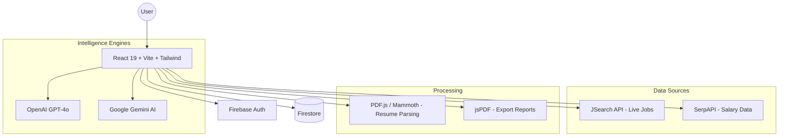

# RoshanAI: The Intelligent Career Illumination Platform

RoshanAI is a comprehensive, AI-driven career intelligence platform designed to empower freelancers and professionals with data-backed insights. Built with **React 19**, **TypeScript**, and **Vite**, and powered by **OpenAI GPT-4o**, **Google Gemini**, and real-time market APIs (**JSearch**, **SerpAPI**), RoshanAI bridges the gap between individual skills and global market demands. It provides a unified dashboard for market intelligence, career gap analysis, profile optimization, and high-stakes negotiation coaching.

---

## Table of Contents

- [Introduction](#introduction)
- [Demo](#demo)
- [UI Preview](#ui-preview)
- [Problem Statement](#problem-statement)
- [Solution](#solution)
- [System Architecture](#system-architecture)
- [Core Modules](#core-modules)
  - [1. Intelligence Layer (Market Analysis)](#1-intelligence-layer-market-analysis)
  - [2. Career Analysis (Gap Analysis)](#2-career-analysis-gap-analysis)
  - [3. Profile Generator](#3-profile-generator)
  - [4. Proposal Generator](#4-proposal-generator)
  - [5. Salary Coach](#5-salary-coach)
- [Tech Stack](#tech-stack)
- [Setup Guide](#setup-guide)
- [License](#license)

---

## Introduction

**Roshan** (meaning "bright" or "illuminated" in Urdu) is an AI-first platform that replaces guesswork in career planning with precision intelligence. Unlike static job boards, RoshanAI analyzes live market data to tell you exactly what skills are trending, how much you should be earning, and how to position yourself to win. It acts as a personal career strategist, resume auditor, and negotiation coach — all in one seamless interface.

---

## Demo

### Platform Walkthrough:

[](https://youtu.be/crTVbzsgehc)

---

## UI Preview

RoshanAI features a modern, dark-themed dashboard designed for high productivity and clarity.

| Homepage | Intelligence Layer |
|---|---|
|  |  |

| Career Analysis | Salary Coach |
|---|---|
|  |  |

| Profile Generator | Proposal Generator |
|---|---|
|  |  |

| My Profile Dashboard | |
|---|---|
|  | |

---

## Problem Statement

The modern professional landscape, especially for freelancers, is plagued by:

- **Information Asymmetry**: Professionals don't know the real-time value of their skills in different global markets.
- **Skill Gaps**: Resumes often fail to align with what employers are actually searching for today.
- **Ineffective Bidding**: Freelancers struggle to write proposals that address specific client pain points.
- **Negotiation Anxiety**: Many professionals accept lower pay because they lack the data or scripts to negotiate effectively.
- **Static Profiles**: LinkedIn and Upwork profiles are often not optimized for the algorithms that drive visibility.

---

## Solution

RoshanAI addresses these challenges through five specialized intelligence modules:

- **Live Market Intelligence**: Fetches real-time job data and salary benchmarks from global and local markets.
- **Automated Gap Analysis**: Audits resumes against target roles to provide a "Gap Score" and a personalized learning roadmap.
- **Algorithmic Profile Optimization**: Reverse-engineers top-performing profiles to generate SEO-optimized summaries and bios.
- **Hyper-Converting Proposals**: Generates tailored proposals with "Smart Client Questions" to demonstrate immediate expertise.
- **AI Negotiation Coaching**: Provides data-backed salary comparisons and rebuttals for tough client conversations.

---

## System Architecture

The platform follows a modern client-side heavy architecture, leveraging powerful AI models and real-time data aggregators:



---

## Core Modules

### 1. Intelligence Layer (Market Analysis)

**Logic:** `marketIntelligence.ts`

The Intelligence Layer is the platform's data engine. It performs parallel API calls to JSearch and SerpAPI to aggregate:
- **Trending Skills**: Identifies high-growth vs. declining technical requirements.
- **Salary Benchmarks**: Compares International (USD/hr) vs. Local (PKR/month) rates.
- **Regional Behavior**: Provides cultural and professional nuances for specific markets (e.g., US vs. UK vs. Pakistan).

### 2. Career Analysis (Gap Analysis)

**Logic:** `CareerAnalysis.tsx`

Users upload their resumes (PDF/DOCX), which are parsed and compared against a target role.
- **Gap Score**: A percentage-based metric of market readiness.
- **Learning Roadmap**: For every missing skill, the AI provides a curated YouTube tutorial, a paid course link, and the top certification to earn.

### 3. Profile Generator

**Logic:** `profileIntelligence.ts`

Optimizes professional presence across Upwork, Fiverr, and LinkedIn.
- **Intelligence Score**: Rates profiles based on SEO, trust factors, and platform compliance.
- **Pattern Matching**: Uses AI to study top-ranked profiles and extract winning patterns for the user.

### 4. Proposal Generator

**Logic:** `ProposalGenerator.tsx`

Streamlines the bidding process by analyzing job descriptions.
- **Smart Client Questions**: Generates deep-dive questions that show the client you understand their problem better than anyone else.
- **AI Refinement**: Allows users to "Rephrase", "Expand", or "Shorten" specific sections of the proposal in real-time.

### 5. Salary Coach

**Logic:** `SalaryCoach.tsx`

A specialized module for the final stage of the hiring process.
- **Opening Scripts**: Ready-to-send response scripts for salary discussions.
- **Rebuttals**: AI-generated responses to common client objections (e.g., "Your rate is too high").
- **Psychology Tips**: Mindset coaching for high-stakes negotiations.

---

## Tech Stack

| Layer | Technology |
|---|---|
| **Frontend Framework** | React 19 (Vite) |
| **Language** | TypeScript |
| **Styling** | Tailwind CSS + Framer Motion |
| **AI Models** | OpenAI GPT-4o, Google Gemini 1.5 Flash |
| **Database & Auth** | Firebase (Firestore, Authentication) |
| **Market Data** | JSearch API, SerpAPI (Google Search) |
| **Document Parsing** | PDF.js (PDF), Mammoth (DOCX) |
| **UI Components** | Lucide React, React Quill (Rich Text) |
| **Export** | jsPDF |

---

## Setup Guide

### Prerequisites

- Node.js (v18+)
- Firebase Project
- OpenAI API Key
- Google Gemini API Key
- SerpAPI Key
- JSearch API Key (RapidAPI)

### Installation

1. **Clone the repository:**
   ```bash
   git clone https://github.com/MaryumAkram16/RoshanAI.git
   cd RoshanAI
   ```

2. **Install dependencies:**
   ```bash
   npm install
   ```

3. **Configure Environment Variables:**
   Create a `.env.local` file in the root directory and add your keys:
   ```env
   VITE_OPENAI_API_KEY=your_openai_key
   VITE_GEMINI_API_KEY=your_gemini_key
   VITE_SERPAPI_KEY=your_serpapi_key
   VITE_RAPIDAPI_KEY=your_jsearch_key
   VITE_FIREBASE_API_KEY=your_firebase_key
   ... (other firebase config)
   ```

4. **Run the development server:**
   ```bash
   npm run dev
   ```

---

## License

This project is licensed under the MIT License - see the [LICENSE](LICENSE) file for details.

Jump to live

